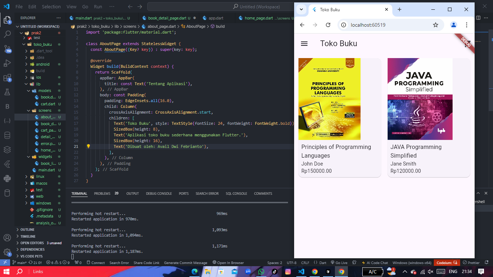
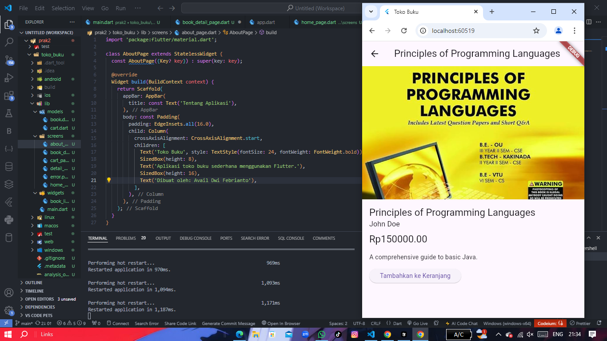
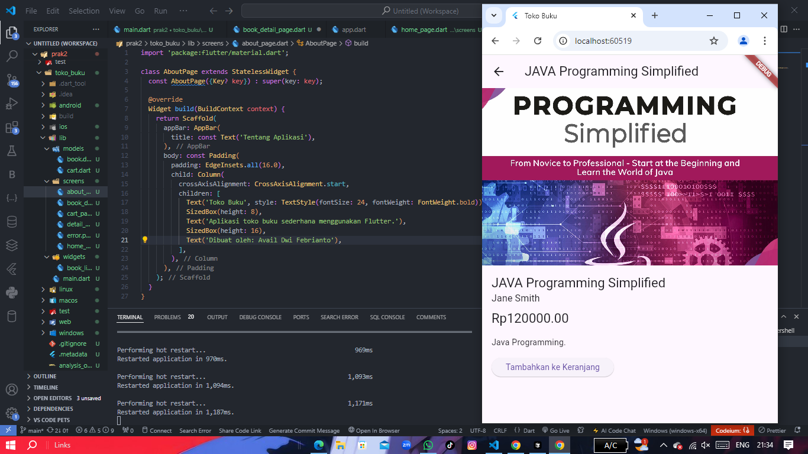
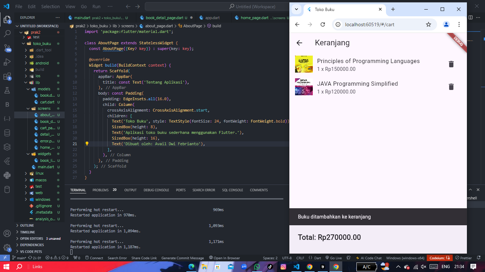
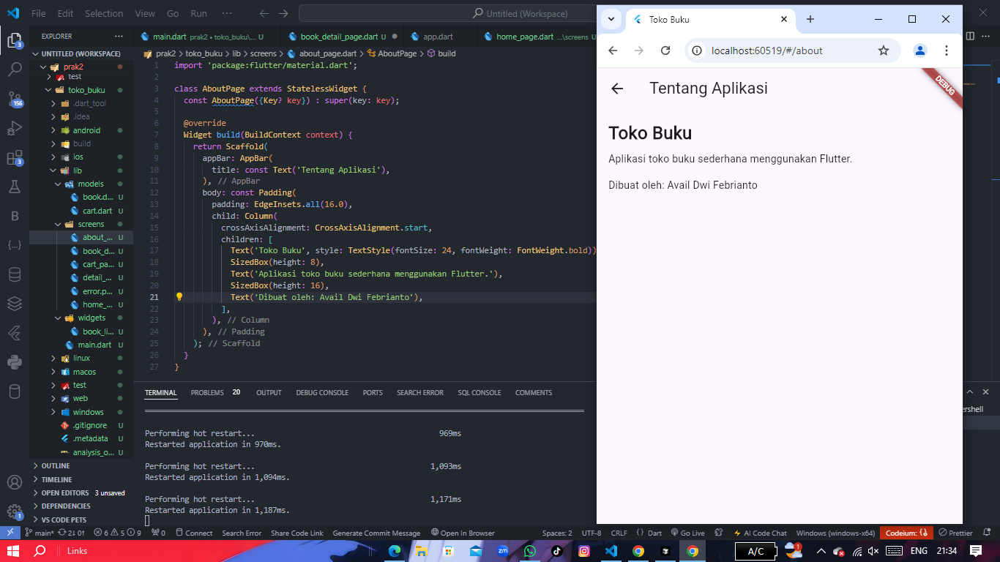

Nama : Avail Dwi Febrianto
NIM : 2170







 Toko Buku Flutter App

Toko Buku adalah aplikasi mobile sederhana yang dibangun menggunakan Flutter. Aplikasi ini memungkinkan pengguna untuk menjelajahi katalog buku, melihat detail buku, dan menambahkan buku ke keranjang belanja.

## Fitur

- Daftar buku dengan gambar dan informasi singkat
- Halaman detail buku
- Keranjang belanja
- Manajemen state menggunakan Provider

## Persyaratan

Sebelum menjalankan aplikasi, pastikan Anda telah menginstal:

- Flutter SDK (versi 2.0.0 atau lebih baru)
- Dart SDK (versi 2.12.0 atau lebih baru)
- Android Studio atau VS Code dengan plugin Flutter

## Cara Menjalankan Aplikasi

1. Clone repositori ini ke komputer lokal Anda:
   ```
   git clone https://github.com/username/toko-buku-flutter.git
   ```

2. Masuk ke direktori proyek:
   ```
   cd toko-buku-flutter
   ```

3. Instal dependensi yang diperlukan:
   ```
   flutter pub get
   ```

4. Jalankan aplikasi:
   ```
   flutter run
   ```

   Aplikasi akan dijalankan pada emulator atau perangkat fisik yang terhubung.

## Struktur Proyek

- `lib/`: Berisi kode sumber Dart
  - `models/`: Model data (Book, Cart)
  - `screens/`: Halaman UI (HomePage, BookDetailPage, CartPage)
  - `main.dart`: Entry point aplikasi
# flutter-toko-buku
# flutter-toko-buku
